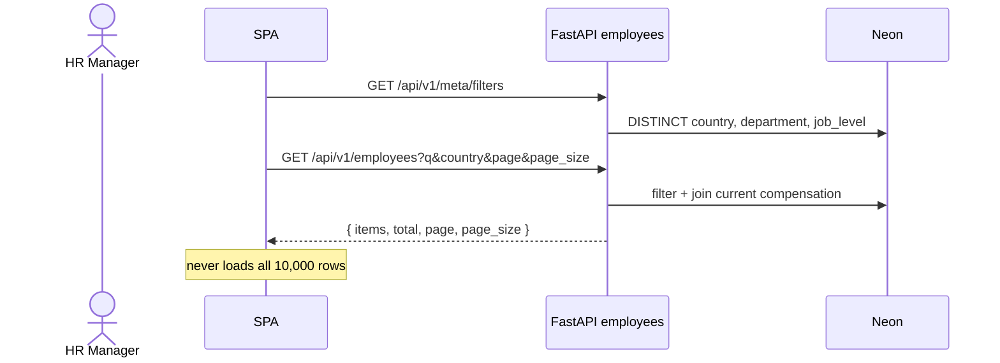
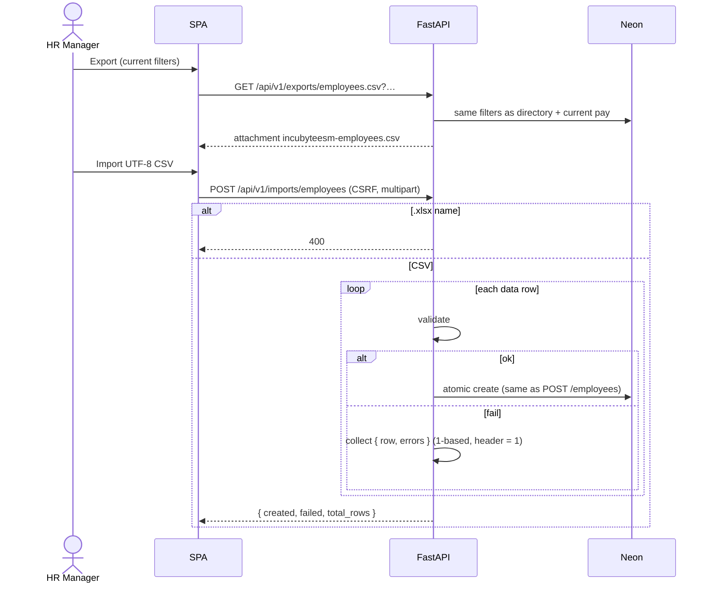

# IncubyteESM — HTTP sequence flows

Companion to [`DATA_AND_ROLES_CYCLE.md`](DATA_AND_ROLES_CYCLE.md) (who / what / state). This file is **time order**: who calls whom for each V1 path.

Actors in every d
    participant Alembic
    participant Seed as python -m app.seed
    participant Neon
    participant App as FastAPI process

    Ops->>Alembic: alembic upgrade head
    Alembic->>Neon: CREATE users, sessions, employees, compensation_records
    Ops->>Seed: --employees 10000 --seed 42
    Seed->>Neon: ensure HR row on users
    Seed->>Neon: INSERT 10k employees + 10k open ledger rows (reason Seed)
    Ops->>App: fastapi deploy / fastapi dev
    Note over App: Startup does NOT migrate or seed
    App->>Neon: GET /ready = SELECT 1 + table names
```

`GET /health` never talks to Neon. `GET /ready` is 503 if the socket fails or required tables are missing.

---
    participant SPA
    participant API as FastAPI auth
    participant Neon

        API->>Neon: INSERT sessions (token_hash = sha256(raw))
        API-->>SPA: 200 + Set-Cookie iesm_session, iesm_csrf
        SPA->>API: GET /api/v1/auth/me
        API-->>SPA: user
        SPA-->>HR: Insights
    end
```

Logout:

```mermaid
sequenceDiagram
    actor HR as HR Manager
    participant SPA
    participant API as FastAPI auth
    participant Neon
r
    participant SPA
    participant API as FastAPI analytics
    participant Neon

    HR->>SPA: Insights (home)
    par
        SPA->>API: GET /api/v1/analytics/summary
        SPA->>API: GET /api/v1/analytics/breakdowns
        SPA->>API: GET /api/v1/analytics/distribution
        SPA->>API: GET /api/v1/analytics/recent-changes
    end
    API->>Neon: SQL on employees JOIN compensation_records
    Note over Neon: ACTIVE + effective_to IS NULL<br/>annual_salary_usd snapshots<br/>recent-changes skip reason = Seed
    API-->>SPA: KPIs, tables, buckets
    SPA-->>HR: cards, chart, breakdowns
```

Percentiles: Postgres `percentile_cont`. SQLite tests return nulls plus a dialect flag.

---

## 3. Directory (search / filter / page)


    HR->>SPA: Add employee + initial salary
    SPA->>API: POST /api/v1/employees (CSRF)
    API->>API: unique email/code, job_level, salary > 0
    API->>FX: to_usd(amount, currency)
    API->>Neon: BEGIN
    API->>Neon: INSERT employees
    API->>Neon: INSERT compensation_records (open row, snapshots)
    API->>Neon: COMMIT
    API-->>SPA: 201 employee + current_compensation
```

If either insert fails, nothing is kept. `employee_code` defaults to next `ESMINCUBYTE-#####`.

---

## 5. Adjust pay (close + insert)

```mermaide_to IS NULL)
    API->>API: reject future from; reject before hire or current period start




---

## 8. Screen → API map

| Screen | Calls |
|---|---|
| `/login` | `POST /api/v1/auth/login` |
| App shell | `GET /api/v1/auth/me`, `POST /api/v1/auth/logout` |
| Insights `/` | `GET .../analytics/summary`, `breakdowns`, `distribution`, `recent-changes` |
| Employees | `GET .../meta/filters`, `GET .../employees`, `GET .../exports/employees.csv`, `POST .../employees`, `POST .../imports/employees` |
| Employee detail | `GET .../employees/{id}`, `PATCH .../employees/{id}`, `GET/POST .../employees/{id}/compensation` |

Swagger remains at `/docs`. It is not the homepage.

---

## 9. Error paths (same cycle, different exit)

| Condition | Status | Data written |
|---|---|---|
| No / bad session | 401 | none |
| Missing Origin or CSRF on mutation | 403 | none |
| Duplicate email or code | 409 | none |
| Future `effective_from`, bad currency, salary ≤ 0 | 400 | none |
| Empty reason (API) | 422 | none |
| Import invnce rules |
| `Docs/DEMO.md` | 3–4 minute walkthrough of these sequences |
